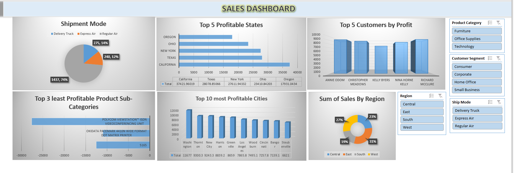

📌 Project Overview

This project is an interactive Sales Performance Dashboard built using Microsoft Excel to analyze sales transactions, profitability, customer performance, shipment modes, and regional trends. The objective of this project was to transform structured sales data into meaningful business insights using Pivot Tables, charts, and slicers for dynamic reporting.

🛠 Tools & Techniques Used

-Microsoft Excel
-Structured Excel Tables
-Pivot Tables & Pivot Charts
-Slicers for dynamic filtering
-Data Cleaning & Transformation
-KPI-Based Performance Analysis

📂 Dataset Description

The project uses three structured datasets:

1️⃣ Orders Table

Contains detailed sales transaction data including:
-Order ID
-Order Date & Ship Date
-Customer ID & Customer Name
-Ship Mode
-Customer Segment
-Product Category & Sub-Category
-Product Name & Base Margin
-Unit Price, Discount, Shipping Cost
-Quantity Ordered
-Sales & Profit
-Country, Region, State, City, Postal Code

This acts as the primary transaction dataset for analysis.

2️⃣ Returns Table

Contains:
-Order ID
-Return Status

Used to analyze returned orders and evaluate their impact on profitability.

3️⃣ Users Table

Contains:
-Region
-Manager

Used to perform region-wise performance analysis and managerial mapping.
All datasets were structured into Excel Tables and used to generate Pivot Tables for dashboard creation.

📊 Key Analysis Performed

-Identified Top 5 Profitable States
-Analyzed Top 5 Customers by Profit
-Determined Least Profitable Product Sub-Categories
-Compared Region-wise Sales Performance
-Evaluated Shipment Mode Distribution
-Analyzed Top 10 Profitable Cities

📈 Dashboard Features

-Interactive Slicers (Region, Product Category, Segment, Ship Mode)
-Pivot Tables for structured analysis
-Pivot Charts connected to slicers
-Automatic updates when slicers are applied
-Business-focused visual reporting

🎯 Business Insights

-Identified high-performing regions contributing maximum revenue
-Detected underperforming product sub-categories affecting profit
-Evaluated shipment modes impacting overall sales distribution
-Enabled strategic decision-making using data visualization

How to Use

-Open the Excel file.
-Navigate to the Sales Dashboard sheet.
-Use slicers to filter by region, product category, segment, or ship mode.
-Observe how all charts and KPIs update dynamically.

📷 Dashboard Preview

